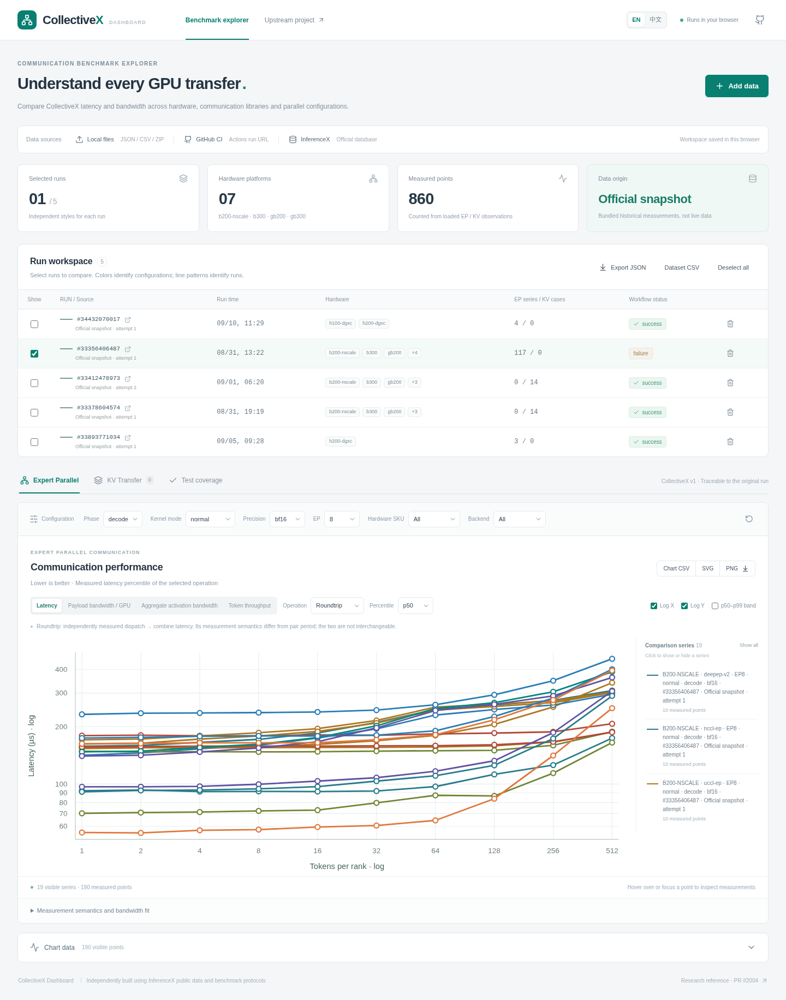

# CollectiveX Dashboard

一个纯前端的 GPU 通信性能实验台，基于 InferenceX CollectiveX 的原始测量协议与官方可视化逻辑独立实现。支持本地文件、GitHub Actions run URL、InferenceX 官方数据库公开 API 三种数据源。

**不提供代理或后端。开发与静态部署都由浏览器直接访问 API；官方实时数据使用浏览器 CORS 插件。** 不需要数据库连接字符串。



## 启动

需要 Node.js 22+ 和 npm：

```bash
cd ~/CollectiveXDashboard
npm ci
npm run dev
```

打开 http://localhost:5173 。初次打开会载入随项目附带的 **5 份真实官方历史快照**，默认选中硬件覆盖较广的 EP sweep。快照抓取时间、URL 和 SHA-256 见 [public/data/index.json](public/data/index.json)；页面将快照与实时数据明确区分，载入时间可在来源标签上查看。

**界面语言**：首次打开默认英文，右上角 `EN / 中文` 可即时切换，导入窗口也有语言开关。选择会单独保存在当前浏览器；切换不会重置数据、筛选或图例。图表提示与 SVG/PNG 导出使用当前语言，原始测量字段、文件名和上游错误详情保留原文。

工作区自动保存在当前浏览器的 IndexedDB。切换浏览器、清理站点数据或使用隐私模式可能丢失工作区；使用“导出 JSON”或“数据 CSV”备份。界面中的移除只修改本地工作区。

## 数据源

| 来源 | 使用方式 | 条件 |
| --- | --- | --- |
| 本地 | 点击或拖入 JSON、JSONL、NDJSON、CSV、ZIP；可同时选择多个文件 | 全部在浏览器内解析，不上传文件 |
| GitHub CI | 粘贴 `https://github.com/owner/repo/actions/runs/123`，可带 `/attempts/2` | 下载 artifact 需要对目标仓库有 `Actions: read` 权限的 token |
| 官方数据库 | “导入最新运行”、“浏览运行列表”或输入 run ID | 通过官方公开 API 读取；启用 CORS 插件 |

**CORS 插件**：使用与 InferenceXCurve 相同的浏览器方案，例如能修改响应头的 Allow CORS 插件。按插件说明启用后，仅对 `inferencex.semianalysis.com` 放行，并授予插件在当前 Dashboard 页面运行的站点权限，再重新连接。GitHub 通常自带有效 CORS 响应头，避免插件为 GitHub 追加重复头。插件不解决 token 权限、API 限流或 artifact 过期；界面会区分这些错误。本地文件和快照不需要插件。

Token 只保留在打开的导入窗口内存中，关闭窗口即清除，不写入浏览器存储、JSON 或 CSV。公共仓库下载 artifact 也需要 token；推荐 fine-grained PAT，目标仓库仅授予 `Actions: read`。如果组织限制 token，需要按该组织策略授权。

GitHub 导入会分页读取 artifacts，每个 cell 选择不超过指定 attempt 的最新 shard，保留未重跑 cell 的旧 artifact。无法恢复已经过期且未备份的 artifact，可尝试官方数据库中已保存的副本。运行失败不意味着所有测量失败，已有有效数据仍可比较。

支持格式和可生成的 CSV 契约见 [docs/import-formats.md](docs/import-formats.md)。[public/example.csv](public/example.csv) 是来自真实 H100 测试的一个点，可用于试导入。

## 分析功能

- **EP**：按 phase、kernel mode、precision、EP size、SKU、backend 筛选。支持 Dispatch、Stage、Combine、Roundtrip、Pair period 和 Isolated sum。
- **指标**：延迟、每 GPU 完整 payload 带宽、聚合 activation 带宽、token 吞吐量；p50 / p90 / p95 / p99，对数或线性坐标，p50–p99 延迟区间。
- **多运行比较**：每个来源和 attempt 独立，配置稳定配色、运行独立线型，点击图例隐藏曲线，悬停或键盘聚焦读取数值及来源。
- **带宽诊断**：对同一系列做 `latency ≈ α + bytes/GPU / β` 拟合，显示 R² 与可靠性提示；不把拟合值当作物理线速。
- **KV Transfer**：带宽 / batch、burst 延迟 / batch、每个 ISL 的带宽上包络、相对 batch=1 的并发收益。bulk 与 paged 分开，page size 来自实际数据。
- **测试覆盖**：展示测量成功、unsupported、failed、invalid、pending 与原因，支持搜索。该表反映所载入运行，不是官方人工维护的全部硬件支持矩阵。
- **导出**：完整工作区 JSON、可再次导入的数据 CSV、当前图表 CSV，以及包含坐标、配置和来源图例的 SVG / PNG。

**测量口径**：当前官方 API 只输出旧的 Roundtrip 等组件，丢弃原始 shard 中新增的 Pair period。两者不能互相补值：Roundtrip 与连续 dispatch→combine 的 Pair period 不是相同测量。缺失分位数、缺失带宽和失败点不会填成 0；曲线在已知缺失点断开。EP 延迟为 µs，KV 延迟为 ms；字段中的 `gbps` 表示 GB/s，不是 Gbit/s。完整研究见 [docs/collectivex-research.md](docs/collectivex-research.md) 和 [docs/data-sources.md](docs/data-sources.md)。

## 静态构建与更新快照

```bash
npm run build
npm run preview
```

把 `dist/` 部署到任意静态托管服务，包括 GitHub Pages。相对资源路径支持仓库子路径，开发和生产都没有 API proxy。请通过 HTTP(S) 打开网站，浏览器不支持从 `file://` 直接运行 ES modules。

快照更新在开发机器或 CI 执行，不需要常驻服务：

```bash
npm run snapshot
# 或明确选择运行
npm run snapshot -- 34432070017 33412478973
npm run build
```

默认保存较新的 EP run、覆盖广的 EP sweep 和两个 KV runs 等至多 5 份代表数据，不等于官方数据库全量数据。原始运行时间与快照抓取时间分别保留。

## 验证与结构

```bash
npm test                   # 解析、单位、统计、图表与来源协议
npm run build              # TypeScript + 生产构建
npx playwright install chromium
npm run test:e2e           # Chromium 中测试完整交互和导出
```

E2E 使用真实快照验证数值，网络异常与 GitHub 权限流程用模拟响应保证可重复，不依赖私有 token。额外的真实 API / GitHub 下载验证记录见 [docs/verification.md](docs/verification.md)。

| 文件 | 职责 |
| --- | --- |
| `src/App.tsx` / `src/styles.css` | 工作区、筛选、EP/KV/coverage 界面 |
| `src/SourcesPanel.tsx` / `src/sources.ts` | 浏览器数据连接、GitHub artifact 选择、错误与 CORS 提示 |
| `src/importers.ts` / `src/export.ts` | 三种来源的统一解析与可往返 CSV |
| `src/i18n.ts` / `src/i18n-react.tsx` | 中英文文案、语言偏好与 React 切换状态 |
| `src/model.ts` / `src/metrics.ts` | 数据契约、指标读取、拟合、KV 数据处理 |
| `src/chart.tsx` | D3 scale/shape + React SVG、交互、图表导出 |
| `src/storage.ts` | IndexedDB 工作区存储 |
| `scripts/snapshot.mjs` / `public/data/` | 可追溯的官方静态快照 |

参考：[InferenceX PR #2004](https://github.com/SemiAnalysisAI/InferenceX/pull/2004)、[CollectiveX sweep workflow](https://github.com/SemiAnalysisAI/InferenceX/actions/workflows/collectivex-sweep.yml)、[InferenceXCurve](https://github.com/Duyi-Wang/InferenceXCurve)、[官方 dashboard](https://inferencex.semianalysis.com/)。本项目为独立工具，不是 SemiAnalysis 官方产品。源码采用 MIT；附带的公开测量数据保留上游来源，数据及第三方依赖遵循各自条款。
